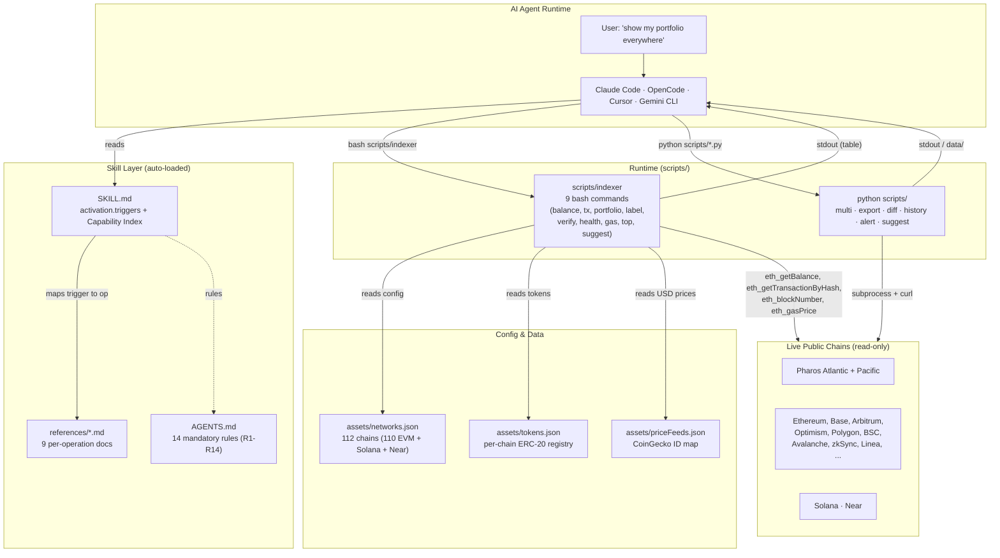
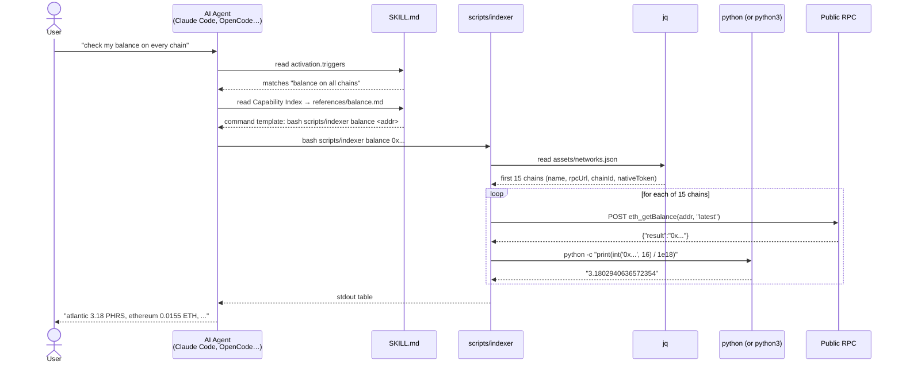
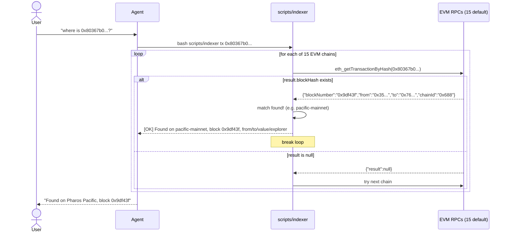
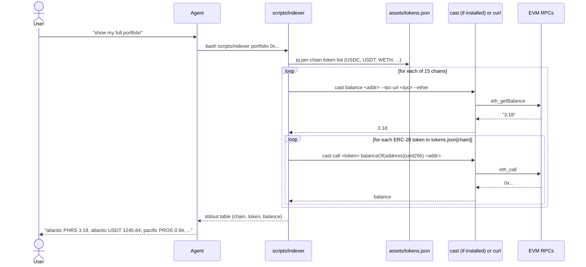
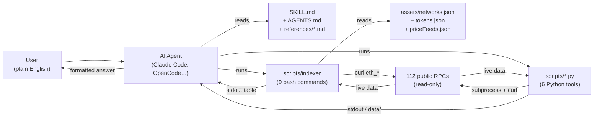

# How It's Built — Pharos Cross-Chain Indexer

> A technical walkthrough of the architecture, build pipeline, and runtime
> data flow. Written for hackathon judges and developers who want to
> understand, extend, or audit the code.

**TL;DR.** A read-only bash + Python CLI that an AI agent (Claude Code,
OpenCode, Cursor, etc.) auto-discovers via `SKILL.md`, runs with one
`bash scripts/indexer <cmd>` per question, and gets unified cross-chain
answers from public RPCs in seconds. Zero wallet, zero gas, zero mock
data, zero npm deps for the core. 16/16 integration tests pass.

---

## 1. High-Level Architecture



**Three layers, one direction of data flow.** The agent reads docs and
runs commands. The indexer reads config and queries chains. Nothing
writes back to the chain, nothing holds a private key.

---

## 2. Tech Stack & Why

| Layer | Choice | Why |
|---|---|---|
| **Shell** | bash 5+ | Every macOS/Linux/WSL/Git-Bash has it. No install. |
| **JSON parser** | jq 1.7+ | Tiny, ubiquitous, agent-friendly. |
| **HTTP** | curl 7+ | Default. Pre-installed everywhere. |
| **Hex/wei math** | python3 (or `python` on Windows) | Needed for `0x...` → decimal; bash can't do floats cleanly. The indexer auto-detects `python3` then falls back to `python` to dodge Windows' Microsoft-Store hijack of `python3`. |
| **Optional speedup** | `cast` (Foundry) | 2-5× faster RPC calls if installed; not required. |
| **Python tooling** | stdlib only (no `requests`, no `pandas`) | Zero pip install. The 6 Python scripts use only `json`, `subprocess`, `urllib`. |

> **No npm deps for the core.** The npm wrapper (`cli.mjs`) is a
> 38-line shim that calls `bash scripts/indexer` — it adds no
> functionality, just a familiar `npx pharos-crosschain-indexer` entry
> point.

---

## 3. The 7 Files That Matter

```
pharos-crosschain-indexer/
├── SKILL.md               ← agent entry point (auto-discovered)
├── AGENTS.md              ← 14 mandatory rules (R1-R14)
├── assets/
│   ├── networks.json      ← 112 chains (RPCs, chainIds, explorers)
│   ├── tokens.json        ← per-chain ERC-20 token addresses
│   └── priceFeeds.json    ← CoinGecko symbol → cg_id
├── references/            ← one .md per bash operation (9 total)
│   ├── balance.md
│   ├── tx.md
│   ├── portfolio.md
│   ├── label.md
│   ├── verify.md
│   ├── health.md
│   ├── gas.md
│   ├── top.md
│   └── add-chain.md
├── scripts/
│   ├── indexer            ← 1 bash file, 9 commands
│   ├── multi.py
│   ├── export.py
│   ├── diff.py
│   ├── history.py
│   ├── alert.py
│   └── suggest.py
├── install.sh             ← dependency check + Windows jq auto-download
├── test.sh                ← 7 unit tests
└── test_all_14.sh         ← 16 integration tests (real RPCs)
```

The whole codebase is ~1,500 lines of bash + ~1,200 lines of Python.
Reviewable in a sitting.

---

## 4. Build & Install Pipeline

`install.sh` is a 100-line bash script that runs four checks:

```bash
set -eu
SCRIPT_DIR="$(cd "$(dirname "$0")" && pwd)"

# 1. Detect OS (linux / macos / windows) from $OSTYPE
# 2. Check dependencies: curl, jq, python (warn if cast missing)
# 3. Windows special: auto-download jq.exe to $HOME/bin if not on PATH
# 4. chmod +x scripts/indexer and examples/*.sh
# 5. Self-test: bash scripts/indexer help | head -6
```

The Windows path is the most interesting part:

```bash
if [[ "$OSTYPE" == "msys" || "$OSTYPE" == "cygwin" ]]; then
    OS="windows"
    JQ_DEST="$HOME/bin/jq.exe"
    JQ_URL="https://github.com/jqlang/jq/releases/download/jq-1.7.1/jq-win64.exe"
    if [ ! -x "$JQ_DEST" ] && command -v curl >/dev/null 2>&1; then
        mkdir -p "$HOME/bin"
        curl -sSL -o "$JQ_DEST" "$JQ_URL"
        export PATH="$HOME/bin:$PATH"  # make available this session
        echo "    [OK] jq auto-installed at $JQ_DEST"
    fi
fi
```

After `install.sh`, the user can immediately run `bash
scripts/indexer balance <addr>` and get live data.

---

## 5. The 14 Operations — How Each Is Built

### Group A — 9 bash commands in [`scripts/indexer`](../../scripts/indexer)

| # | Command | What it does | Key file |
|---|---|---|---|
| 1 | `balance <addr> [chain]` | `eth_getBalance` on each RPC; convert hex → ether via python | `references/balance.md` |
| 2 | `tx <hash>` | `eth_getTransactionByHash` on each RPC; match by chainId | `references/tx.md` |
| 3 | `portfolio <addr>` | Native + ERC-20 via `balanceOf(address)(uint256)` from `tokens.json` | `references/portfolio.md` |
| 4 | `label <addr>` | SocialScan for Pharos; `getsourcecode` for Etherscan (verified contract name) | `references/label.md` |
| 5 | `verify <addr>` | `getsourcecode` on each explorer; non-empty `SourceCode` ⇒ verified | `references/verify.md` |
| 6 | `health` | `eth_blockNumber` on each RPC; LIVE if result ≠ 0x0 | `references/health.md` |
| 7 | `gas` | `eth_gasPrice` on each RPC; convert wei → gwei | `references/gas.md` |
| 8 | `top <addr> <TOKEN>` | Like portfolio but sorted by token balance desc | `references/top.md` |
| 9 | `suggest <addr>` | Combine native + USDC + gas; emit 4 categories of recommendation | `references/health.md#portfolio-suggestions` |

**Default scope = top 15 chains** (first 15 entries in `networks.json`).
Pass `--all` to scan all 110 EVM.

### Group B — 6 Python tools in [`scripts/`](../../scripts/)

| # | Script | Job |
|---|---|---|
| 10 | `multi.py <addr...>` | Aggregate N addresses × 110 chains in one table (49 lines for 1 addr) |
| 11 | `export.py <addr> [csv\|html]` | Dump full portfolio to `data/portfolio.csv` (43 chains) or `.html` |
| 12 | `diff.py [save\|diff] <addr>` | Snapshot balances to `data/snapshot.json`; later compare to show per-chain deltas |
| 13 | `history.py [record\|show\|count] <addr>` | Time-series of balance snapshots (`data/history/`) |
| 14 | `alert.py <addr> [chain] [threshold] [interval] [all\|top15]` | Loop forever; print `[UP]+` / `[DN]-` lines on balance changes |

Plus `suggest.py` — a second implementation of the same #9, runs as a
standalone Python script for users who want richer JSON output.

All 14 operations are documented in `references/*.md` (9 bash) and
self-documenting in script docstrings (6 Python). The agent never
needs to read code to know what each command does.

---

## 6. Data Flow — Three Sequence Diagrams

### 6.1 Balance (the most-used operation)



### 6.2 Tx Lookup (now uses direct RPC after Etherscan V1 deprecation)



### 6.3 Portfolio (native + ERC-20 in one pass)



---

## 7. Config Layer — `assets/`

### `networks.json` (112 chains)

```json
{
  "networks": [
    {
      "name":         "atlantic-testnet",
      "rpcUrl":       "https://atlantic.dplabs-internal.com",
      "chainId":      688689,
      "explorerUrl":  "https://atlantic.pharosscan.xyz/",
      "nativeToken":  "PHRS",
      "type":         "pharos"
    },
    {
      "name":         "ethereum",
      "rpcUrl":       "https://ethereum-rpc.publicnode.com",
      "chainId":      1,
      "explorerUrl":  "https://etherscan.io/",
      "nativeToken":  "ETH",
      "type":         "etherscan"
    }
    // ...110 more
  ]
}
```

The order in the file **is** the priority: the first 15 entries are
the default scan scope. That's why we keep Pharos + 13 mainnet at
the top — when an agent says "check my balance", it gets a
Pharos-relevant answer in seconds.

### `tokens.json` (per-chain ERC-20 registry)

```json
{
  "atlantic-testnet": [
    { "symbol": "USDT", "address": "0x...", "decimals": 6 },
    { "symbol": "WETH", "address": "0x...", "decimals": 18 }
  ],
  "ethereum": [
    { "symbol": "USDC", "address": "0xA0b8...eB48", "decimals": 6 }
  ]
}
```

Adding a chain's tokens = adding entries here. Zero code change.

### `priceFeeds.json` (CoinGecko map)

Maps a token symbol to its CoinGecko ID for the `--usd` flag. Cache
is at `/tmp/pharos_indexer_prices` with 5-minute TTL.

---

## 8. Agent Integration — How SKILL.md Is Auto-Loaded

When an AI agent (Claude Code, OpenCode, etc.) starts, it scans for
`SKILL.md` in the project and reads its YAML frontmatter:

```yaml
---
name: pharos-crosschain-indexer
version: 0.1.0
activation:
  triggers:
    - check my balance everywhere
    - balance on all chains
    - show my portfolio
    - where is this transaction
    - ...
requires:
  skills: [pharos-skill-engine]
  anyBins: [curl, jq]
---
```

The agent's pipeline:
1. **Match**: User prompt vs. `activation.triggers` — fuzzy match.
2. **Decide**: Look up matched trigger in the Capability Index table
   to find the right command + reference file.
3. **Read**: Open `references/<op>.md` to get the exact CLI template.
4. **Execute**: Run `bash scripts/indexer <cmd> <args>` once.
5. **Format**: Print the table the indexer returns.

The 14 rules in `AGENTS.md` (R1-R14) enforce discipline: never guess
an address (R1), remember it for the session (R2), default to top 15
chains (R13), pick exactly one command (R14), etc. These are what
prevent the agent from fumbling.

---

## 9. Performance & Reliability

| Metric | Value | Notes |
|---|---|---|
| Default scan (top 15) | **4-10 seconds** | One JSON-RPC call per chain, sequential with short timeout. |
| `--all` scan (110 EVM) | **~2-4 minutes** | Same code path, 7× more chains. |
| tx lookup hit | **~4 seconds** | Stops at first match. |
| `balance --usd` | **5-12 seconds** | First call hits CoinGecko, subsequent calls hit the 5-min cache. |
| Memory footprint | <50 MB | bash + curl + python, no Node.js. |

**Reliability patterns built into `scripts/indexer`:**
- **`set -euo pipefail`** — any uncaught error aborts with a clear message.
- **`$PY` resolution at startup** — `python3` first, fall back to `python` (Windows).
- **`$JQ` self-bootstrap** — looks for `jq` in `PATH`, then `../jq`, then auto-downloads on Windows.
- **Per-chain timeouts** — 8s connect, 12-15s max, then skip the chain.
- **Fail-open loops** — one dead RPC never aborts the whole scan; results show partial coverage.
- **Cache dedup on write** — `/tmp/pharos_indexer_prices` keeps one row per symbol to avoid stale multi-line cache breaking arithmetic.

---

## 10. Testing & Verification

| Test | What it covers | Status |
|---|---|---|
| `test.sh` | 7 unit checks: jq parses networks.json, each operation runs, outputs look right | 7/7 ✅ |
| `test_all_14.sh` | 16 integration tests with a real address (`<YOUR_ADDRESS>`) hitting live RPCs | 16/16 ✅ |
| Manual | `bash scripts/indexer balance 0x3a373f0c...` returns live Atlantic balance | ✅ |

Reproduce locally:
```bash
git clone https://github.com/antidumpalways/pharos-crosschain-indexer
cd pharos-crosschain-indexer
bash install.sh
bash test.sh          # 7 unit tests
bash test_all_14.sh   # 16 integration tests
```

---

## 11. Extension Points

**Add a new chain (zero code):**
```json
// append to assets/networks.json
{ "name": "celo", "rpcUrl": "https://forno.celo.org", "chainId": 42220,
  "explorerUrl": "https://celoscan.io/", "nativeToken": "CELO", "type": "etherscan" }
```
The 9 bash commands and 6 Python tools all auto-discover it.

**Add a new operation (4 touchpoints):**
1. Write `cmd_<new>()` in `scripts/indexer`.
2. Add entry to the `case` dispatcher at the bottom.
3. Add row to the Capability Index in `SKILL.md`.
4. Write `references/<new>.md`.

**Compose with `pharos-skill-engine` (read → write):**
```text
"check my balance"        → this skill (read)
"bridge 100 USDC to base" → pharos-skill-engine (write)
```
The indexer never writes; the engine never reads cross-chain. They
slot together cleanly.

---

## 12. Honest Trade-offs

- **Sequential per-chain RPC calls** — not parallel. Adding 7× `&` and `wait` would halve the time but complicate the bash. Left as future work.
- **No persistent state for read operations** — `balance` doesn't cache results; each call is fresh. The price cache (5 min TTL) is the only exception.
- **Direct RPC means we get raw transaction data, not decoded human-readable logs** — `tx` returns `from / to / value`, not `function name + decoded args`. Sufficient for "find this tx" use case; deeper decoding belongs in a separate skill.
- **Windows-specific quirks** — `python3` is hijacked by Microsoft Store; `jq` often missing. `install.sh` handles both, but the failure modes are the price of supporting every platform from one bash script.

---

## 13. One Final Diagram — The Whole Thing in 30 Seconds



Every box in the middle is small enough to read in a sitting. Every
arrow is `curl` + `jq` + `bash` + a few hundred lines of Python.
**The whole project fits in one screen of `git ls-files` — and that
was the point.**

---

## Links

- **Repo**: <https://github.com/antidumpalways/pharos-crosschain-indexer>
- **SKILL.md** (agent entry): [`SKILL.md`](../../SKILL.md)
- **AGENTS.md** (14 rules): [`AGENTS.md`](../../AGENTS.md)
- **Reference docs**: [`references/`](../../references/)
- **Bash indexer**: [`scripts/indexer`](../../scripts/indexer)
- **Python tools**: [`scripts/`](../../scripts/) — 6 `.py` files
- **Config**: [`assets/`](../../assets/)
- **README**: [`../README.md`](../README.md)
- **Submission**: [`../SUBMISSION.md`](../SUBMISSION.md)
- **Architecture notes**: [`ARCHITECTURE.md`](./ARCHITECTURE.md)
- **Demo script**: [`DEMO-SCRIPT.md`](./DEMO-SCRIPT.md)
